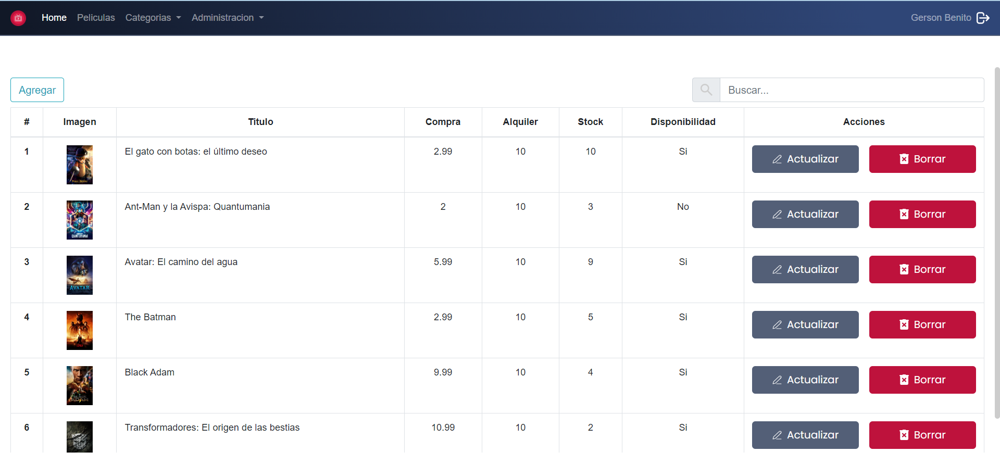

# MovieFrontend

Instalar dependencias run `ng serve`

## Development server

Run `ng serve` for a dev server. Navigate to `http://localhost:4200/`. The application will automatically reload if you change any of the source files.

